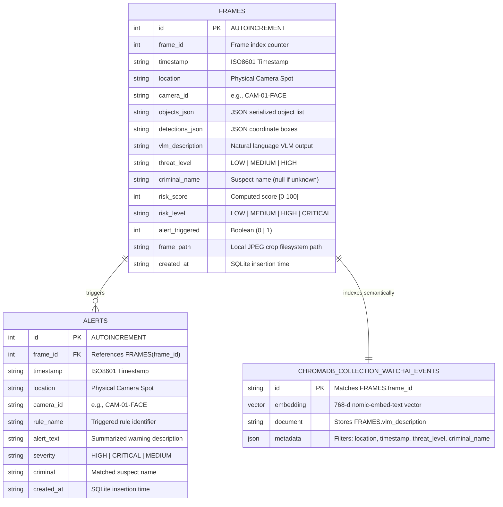
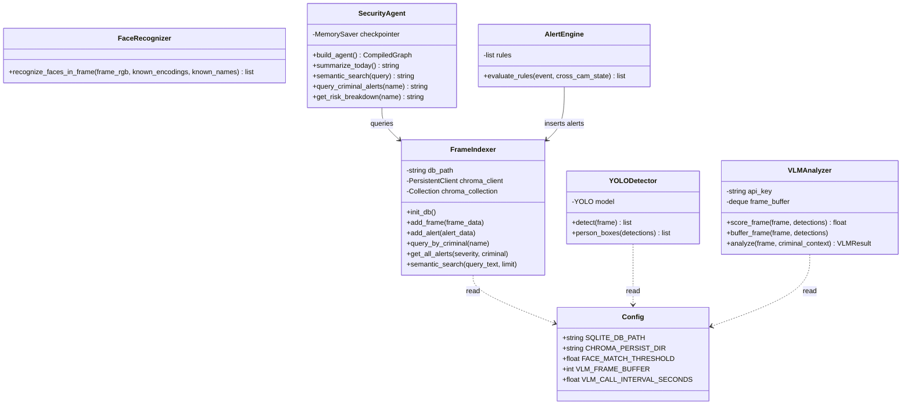

# WatchAI — Database Schemas & System Flow Diagrams

This document contains the Entity-Relationship (ER) database schema and UML class & sequence diagrams for the WatchAI surveillance platform.

---

## 1. Entity-Relationship (ER) Diagram

This diagram displays the relational SQLite layer and the ChromaDB vector database index.

---

## 2. UML Class Diagram

This diagram shows the structural classes of the backend engine, showing the modular architecture from ingestion down to agent execution.

---

## 3. UML Sequence Diagram

This details the sequential message-passing and thread execution flow during real-time multi-camera processing.

```mermaid
sequenceDiagram
    autonumber
    actor Operator as Security Operator
    participant UI as React Command UI
    participant Server as FastAPI Server
    participant C1 as Camera 1 Thread (Face Cam)
    participant Cache as Shared Cache (30s TTL)
    participant C2 as Camera 2 Thread (Scene Cam)
    participant VLM as Gemini VLM API
    participant DB as FrameIndexer (SQLite + Chroma)

    Operator->>UI: Click "Engage" (Start Live Monitoring)
    UI->>Server: POST /control (action="start", role="face")
    Server->>Server: Spin up C1 and C2 background threads
    
    par Camera 1 (Biometrics Loop)
        rect rgb(40, 50, 40)
            C1->>C1: Capture BGR Frame & run MOG2 motion gate
            C1->>C1: Run YOLOv8 detection and crop faces
            C1->>C1: Compute Euclidean distance against Encodings
            alt Match <= 0.55 (Suspect Identified)
                C1->>Cache: _set_criminal_context(Suspect Profile)
            end
            C1->>DB: add_frame(biometric event metadata)
            C1->>Server: Push event packet to WebSocket queue
        end
    and Camera 2 (Situational Loop)
        rect rgb(50, 40, 40)
            C2->>C2: Capture BGR Frame & run MOG2 motion gate
            C2->>C2: Run YOLOv8 detection
            C2->>Cache: _get_criminal_context()
            Cache-->>C2: Return context (if <30s old)
            C2->>C2: Add frame to Top-N buffer (Score quality)
            alt Buffer Full (10 frames accumulated)
                C2->>VLM: Send highest-scoring frame + enriched prompt
                VLM-->>C2: Return Threat level & Description
            end
            C2->>DB: add_frame(VLM report & threat level)
            C2->>Server: Push event packet to WebSocket queue
        end
    end

    Server-->>UI: Broadcast base64 annotated JPEGs + JSON metadata
    UI->>Operator: Update live camera hud, lists, and fire severity alerts
```

